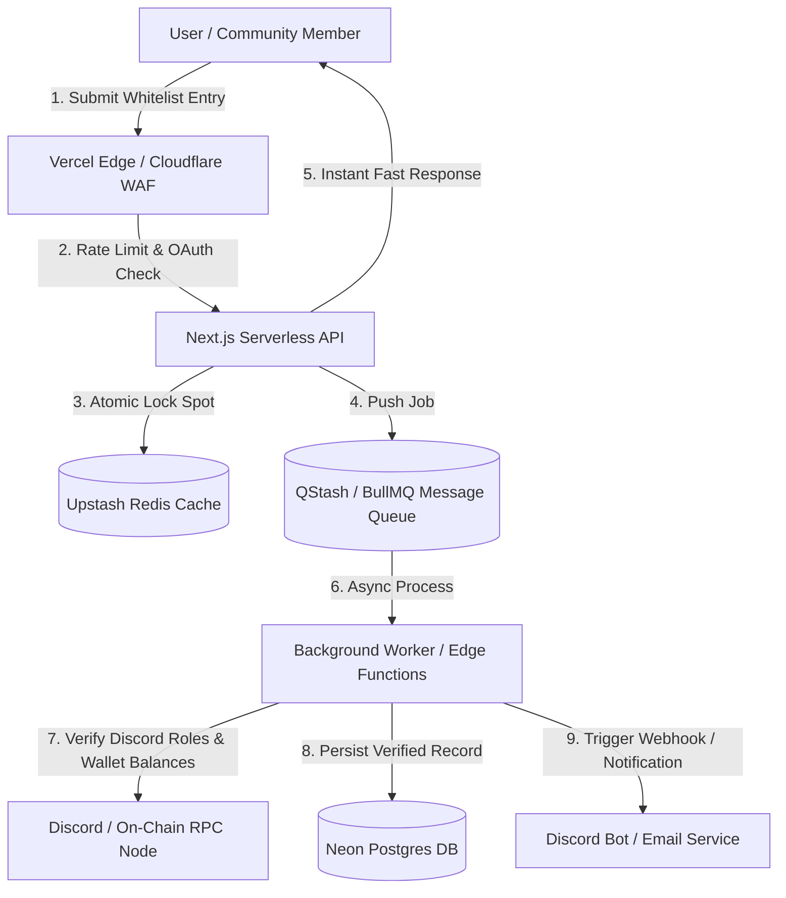

# Oncollably — Platform Overview & Scalability Architecture Breakdown

## 1. Executive Product & Architecture Overview

**Oncollably** is an end-to-end **Web3 Collaboration & Whitelist (Allowlist) Management Platform**. It operates at the intersection of Web3 projects, community DAOs, and freelance/agency Collaboration Managers (CMs).

### Core Ecosystem Personas & Workflows
1. **Projects (Creators / Protocols / NFT Mints)**:
   - Create giveaway & whitelist allocation campaigns.
   - Set qualification criteria (Discord roles, X/Twitter follows, wallet minimum balance).
   - Review applications from communities and CMs, verify entries, and export clean, sybil-free wallet allowlists for smart contract minting.
2. **Communities & DAOs (Alpha Groups / Guilds)**:
   - Request guaranteed whitelist spots from top-tier projects for their members.
   - Automate role distribution and tracking via Discord bot integrations.
   - Monitor historical allocation efficiency and winner verification.
3. **Collab Managers (CMs / Agencies)**:
   - Manage rosters of client projects in a unified hub.
   - Showcase verified portfolios and past performance metrics on public profiles (`/[username]`).
   - Pitch projects and negotiate collab deals without chaotic Twitter DMs or Discord messages.

---

## 2. Current Architecture Snapshot & Tech Stack Audit

| Layer | Current Implementation | Status / Observation |
| :--- | :--- | :--- |
| **Frontend Framework** | Next.js 16.3.3 (App Router), React 19, Tailwind CSS v4, Framer Motion | High-end visual aesthetic, responsive layouts; heavily dependent on `"use client"` components with mock data. |
| **Authentication** | Better Auth v1.7.2 with Drizzle Adapter & Google OAuth | Functional auth foundation; lacks Web3 wallet auth (SIWE/Solana), Discord OAuth, and X OAuth. |
| **Database & ORM** | Drizzle ORM v1.0.0-rc.4 + Neon Serverless PostgreSQL | Database schema contains **only Auth tables** (`user`, `session`, `account`, `verification`). No domain schemas exist. |
| **Backend / API** | Route Handlers (`/api/auth/[...all]`, `/api/og`) | Zero business logic API routes or Server Actions. Form submissions only trigger frontend Sonner toasts. |
| **Services Layer** | Directory placeholders (`discord/`, `email/`, `notifications/`, `referral/`, `verification/`, `x/`) | 100% empty directories. |
| **Payments / Monetization**| Text references in Onboarding UI ($10 workspace setup fee) | No Stripe or Web3 payment integration. |

---

## 3. Engineering Lapses, Drawbacks & Security Loopholes

### A. Security & Vulnerability Analysis

> [!CAUTION]
> **1. Unverified Social Handles & Sybil Bot Flooding**
> - **Lapse**: Forms allow users to type arbitrary text for Discord tags and Twitter handles without OAuth validation.
> - **Risk**: Sybil attackers can script thousands of submissions using fake handles to hog whitelist spots.
> - **Fix**: Enforce OAuth2 state-verified authentication for Discord (`/api/auth/discord`) and X/Twitter (`/api/auth/x`) via Better Auth plugins or custom OAuth providers before allowing campaign entry.

> [!CAUTION]
> **2. Unsigned Wallet Submissions (Lack of Cryptographic Proof)**
> - **Lapse**: Wallet inputs are plain text strings in client components.
> - **Risk**: Bots can submit public wallet addresses belonging to whale accounts without owning the private keys.
> - **Fix**: Integrate EIP-4361 (Sign-In With Ethereum - SIWE) and Solana Wallet Adapter. Require cryptographic signatures (`personal_sign` / `ed25519`) proving ownership of the wallet address at entry time.

> [!WARNING]
> **3. Missing API Rate Limiting & DDoS Vulnerability**
> - **Lapse**: Public routes (`/c/[slug]`, `/[username]`) and backend route handlers have no rate limit guards.
> - **Risk**: Scraping bots, spam submissions, or malicious traffic spikes can overwhelm serverless execution limits and exhaust database connection limits.
> - **Fix**: Deploy `@upstash/ratelimit` middleware backed by Redis for IP and user-based token bucket rate limiting (e.g., max 10 submissions per minute per IP).

---

### B. Database & Data Layer Scalability

> [!IMPORTANT]
> **1. Missing Relational Domain Schema**
> - The database currently lacks tables for the core domain. As usage grows, relational integrity, foreign key cascading, and indexing must be designed upfront.
> - **Required Schema Model**:
>   - `workspaces`: (`id`, `owner_id`, `type` [project|community|cm], `name`, `slug`, `avatar_url`, `created_at`)
>   - `campaigns`: (`id`, `workspace_id`, `title`, `slug`, `total_spots`, `allocation_type`, `status`, `expires_at`)
>   - `campaign_allocations`: (`id`, `campaign_id`, `community_id`, `allocated_spots`, `claimed_spots`)
>   - `applications`: (`id`, `campaign_id`, `applicant_workspace_id`, `requested_spots`, `status`, `pitch`)
>   - `entries`: (`id`, `campaign_id`, `user_id`, `wallet_address`, `discord_id`, `x_id`, `status`, `submitted_at`)
>   - `cm_portfolios`: (`id`, `user_id`, `project_name`, `metrics`, `verified_badge`)

> [!WARNING]
> **2. High-Traffic Over-Allocation Race Conditions**
> - **Lapse**: If 500 users click "Claim Whitelist Spot" simultaneously when 5 spots remain, naive `SELECT count(*)` checks followed by `INSERT` will result in race conditions and over-allocation.
> - **Fix**: Execute claims inside Postgres isolation transactions with atomic counters:
>   ```sql
>   UPDATE campaign_allocations 
>   SET claimed_spots = claimed_spots + 1 
>   WHERE id = $1 AND claimed_spots < allocated_spots 
>   RETURNING id;
>   ```
> - Alternatively, leverage Redis `DECRBY` atomic keys for real-time inventory locking before DB persistence.

> [!NOTE]
> **3. Database Connection Pooling for Serverless Traffic Spikes**
> - **Lapse**: `@neondatabase/serverless` using stateless HTTP driver is sufficient for simple reads, but creates overhead during sustained connection heavy operations.
> - **Fix**: Use Neon's WebSocket driver with connection pooling (`pgBouncer` / Neon Pooled Connection String) for long-lived backend handlers and background workers.

---

### C. Speed, Performance & Global CDN Caching

> [!TIP]
> **1. Edge Caching & ISR for Public Dynamic Pages**
> - **Lapse**: Dynamic public pages (`/c/[slug]` and `/[username]`) rely heavily on client-side rendering with full JS execution on every page visit.
> - **Fix**: Implement Next.js Incremental Static Regeneration (ISR) or `stale-while-revalidate` HTTP headers:
>   - Serve static HTML from Vercel Edge CDN nodes globally (sub-50ms TTFB).
>   - Revalidate pages in the background every 60 seconds (`export const revalidate = 60`).

> [!TIP]
> **2. Dynamic OG Image Cache Optimization (`/api/og`)**
> - **Lapse**: Dynamic canvas/JSX rendering of OpenGraph images on social media links consumes high server CPU.
> - **Fix**: Set cache control headers on the OG route handler:
>   `Cache-Control: public, max-age=31536000, immutable`
> - Cache output image buffers in Cloudflare R2 / AWS S3 or Upstash Redis to prevent repeated generation.

> [!TIP]
> **3. Server Component Architecture vs. Heavy Client Bundles**
> - **Lapse**: Layouts and dashboard sub-pages currently mark entire pages with `"use client"`, transmitting unnecessary JavaScript to the client.
> - **Fix**: Refactor pages into Server Components for data fetching, passing serialized data down to interactive Client Component islands.

---

### D. High-Load Infrastructure & Queueing Architecture



#### Why Decoupled Async Workers are Essential for Scale:
1. **Prevent Timeout Failures**: Checking Discord role membership via Discord REST API for 1,000 users during a mint spike will hit Discord API rate limits (HTTP 429).
2. **Buffer Traffic Spikes**: Pushing incoming entries to an in-memory Queue (Upstash QStash, BullMQ, or AWS SQS) allows the backend to acknowledge receipt instantly (<100ms response time) while background workers process verification at controlled rates.

---

## 4. Scalability Engineering Roadmap

### Phase 1: Core Foundation & Data Layer (Immediate)
- [ ] Define comprehensive Drizzle ORM schemas for `workspaces`, `campaigns`, `allocations`, `applications`, and `entries`.
- [ ] Implement Server Actions and API endpoints replacing local mock state.
- [ ] Integrate Web3 wallet connection (Wagmi/Viem for EVM & Solana Wallet Adapter).
- [ ] Add SIWE / cryptographic signature verification for wallet entry.

### Phase 2: Authentication & Service Integrations (Short-Term)
- [ ] Add Discord OAuth2 & Twitter/X OAuth2 verification flows inside `services/discord` and `services/x`.
- [ ] Implement Discord Bot integration (`services/discord/bot.ts`) for real-time role checking and auto-assigning winner roles.
- [ ] Integrate Stripe & Crypto Payment Gateways (e.g. Coinbase Commerce / Solana Pay) for workspace creation fee verification.

### Phase 3: High-Performance Caching & Queuing (Growth Scale)
- [ ] Set up Upstash Redis for rate-limiting, session cache, and campaign spot counters.
- [ ] Implement QStash / BullMQ for async background role verification and wallet export compilation.
- [ ] Configure ISR caching on `/c/[slug]` and `/[username]` public pages.

---

## 5. Summary Matrix for Production Readiness

| Bottleneck Category | Severity | Recommended Tech Solution | Key Benefit |
| :--- | :--- | :--- | :--- |
| **Data Integrity & Race Conditions** | **CRITICAL** | DB Transactions + Redis Atomic Counters | Zero over-allocation of whitelist spots during high-concurrency mint drops. |
| **Bot & Sybil Exploits** | **CRITICAL** | SIWE Signatures + Discord/X OAuth2 | 100% verified human participants with cryptographic wallet proof. |
| **API Timeout / Traffic Crashes** | **HIGH** | BullMQ / QStash Async Queues | Sub-100ms API response time regardless of incoming spike volume. |
| **Page Speed & Server Load** | **HIGH** | Next.js ISR + Edge CDN Caching | Lightning fast global load times (<50ms) and minimal server compute costs. |
| **Monetization & Access Control** | **MEDIUM** | Stripe Webhooks / On-Chain Payment Verification | Guaranteed revenue capture before workspace feature activation. |
